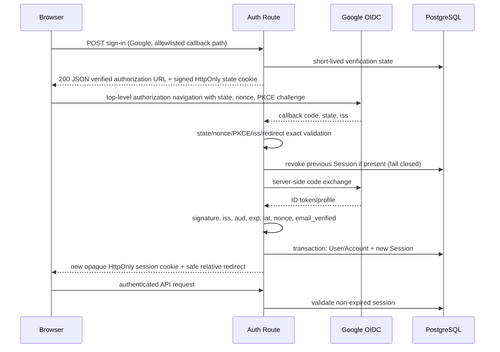
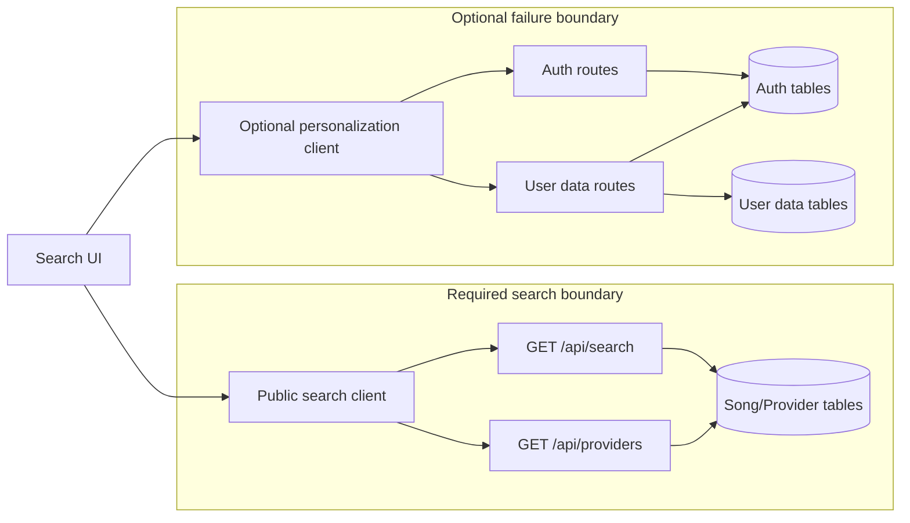

# M3 인증 및 사용자 데이터 기술 설계 v0.1

- 상태: T01 설계 확정 기준선 (2026-07-13 승인, 후속 구현이 저장소에 반영됨)
- 작성일: 2026-07-12
- 범위: M3-T01만 포함. dependency, Prisma schema, migration, route, UI 변경은 포함하지 않는다.
- 기준: M3 milestone, M3-T01, Lean PRD, MVP 기술 구현 계획, MVP 첫 milestone 개발 태스크, 조회 성능 진단 계획, 데이터 시드 명세

현재 구현·운영 절차는 `docs/m3-t02-migration-runbook.md`, `docs/m3-t03-google-oauth-session.md`, `docs/m3-t13-browser-e2e.md`와 `prisma/README.md`를 함께 확인한다. 아래 "T01 작성 시점 구조"는 T01 결정 당시의 기준선을 기록한 역사적 문맥이다.

## 목표와 범위

비로그인 검색과 번호 확인을 그대로 유지하면서 Google OAuth, 폐기 가능한 서버 세션, 사용자별 즐겨찾기·최근 검색어·기본 제공사를 후속 티켓이 추가 해석 없이 구현할 수 있도록 보안 경계와 계약을 확정한다.

포함 범위는 인증 라이브러리, OAuth 검증, 세션 정책, 사용자 데이터 모델 초안, 보호 API/CSRF 규칙, 로컬 데이터 병합, 검색 장애 격리와 T05·T06·T08 입력 계약이다. Google 외 제공사, 자체 계정, 계정 연결·자동 병합, 비로그인 즐겨찾기, Admin/크롤링/제공사 동기화는 제외한다.

## T01 작성 시점 구조 (2026-07-12)

- Next.js `16.2.9` App Router, React `19.1`, TypeScript strict, Node Route Handler 구조다.
- Prisma `7.8.0` + `@prisma/adapter-pg` + PostgreSQL이며 단일 `getPrismaClient()`가 최대 5 connection pool을 공유한다.
- 공개 `GET /api/search`, `GET /api/providers`는 route 파일과 주입 가능한 순수 handler/service를 분리하고 Vitest에서 DB 없이 handler를 검증한다.
- 검색 응답은 `query`, `normalized_query`, `items`, `next_cursor`, `suggestions`이며 관련도 우선·제공사 수록/수록 수/최신성 보조 정렬을 구현한다.
- 작성 시점 Prisma에는 `Song`, `SongAlias`, `KaraokeProvider`, `KaraokeEntry`만 있었다. 인증 dependency, 사용자/계정/세션/개인화 모델, 인증 route, CSRF 공통 모듈은 후속 티켓에서 추가했다.
- 테스트는 `**/*.test.ts(x)`를 Node 환경에서 실행한다. UI 테스트만 파일별로 jsdom을 지정한다.

### 기존 결정과 코드의 차이

| 기준 결정                    | 현재 코드                        | T01 결정                             |
| ---------------------------- | -------------------------------- | ------------------------------------ |
| Google OAuth 단일 제공사     | 인증 없음                        | Better Auth Google provider만 활성화 |
| 로그인 후 서버 사용자 데이터 | 모델/API 없음                    | 아래 모델·계약을 T02 이후 구현       |
| 비로그인 검색 유지           | 검색 API 공개                    | 현 상태 유지, 인증 모듈 import 금지  |
| 제공사 동적 구성             | `/api/providers`, DB provider ID | 선호 제공사는 FK로만 저장            |
| 인증/개인화 실패 격리        | 개인화 없음                      | 별도 모듈·요청·UI error boundary     |
| 최근 검색 최대 10개          | 저장 없음                        | 정규화 키 unique + transaction prune |

## 결정 사항과 근거

### 인증 및 세션 라이브러리

**Better Auth v1.6 계열 + 공식 Prisma adapter + PostgreSQL database session을 권고한다.** T02 착수 시 당시 최신 patch를 다시 확인하고 정확한 버전을 lockfile에 고정한다. 이번 T01에서는 설치하지 않는다.

선택 근거:

- 공식 문서가 Next.js 16 App Router/`proxy.ts` 호환과 route별 서버 세션 검증을 명시한다.
- Prisma adapter가 Prisma 7 custom output import를 명시적으로 지원한다.
- Google OAuth/OIDC, state·PKCE, callback origin 검증, DB session 폐기 API, HttpOnly cookie와 origin 기반 CSRF 방어를 한 경계에서 제공한다.
- 현재 handler factory 패턴을 유지해 인증 확인과 domain service를 각각 mock할 수 있다.
- Auth.js는 App Router 친화적이고 Prisma adapter가 있으나 공식 Next.js 설치가 여전히 `next-auth@beta`이고 프로젝트가 Better Auth에 편입되어 신규 도입의 유지보수 경로가 불리하다.

공식 근거: [Better Auth Next.js integration](https://better-auth.com/docs/integrations/next), [Prisma adapter](https://better-auth.com/docs/adapters/prisma), [session management](https://better-auth.com/docs/concepts/session-management), [security](https://better-auth.com/docs/reference/security). Better Auth가 보안 검사를 제공하더라도 T02에서 실제 설치 버전의 source/type과 생성 schema를 검토하고 테스트로 고정한다.

## 인증 흐름



1. 브라우저는 애플리케이션의 same-origin auth route에 POST한다. `callbackURL`은 서버 allowlist의 상대 경로(`/`, `/favorites`, `/settings`)만 받으며 임의 absolute URL은 거부한다.
2. Authorization Code flow에 `openid email profile`, state, nonce, S256 PKCE를 사용한다. Google API 접근은 없으므로 offline access/추가 scope/refresh token을 요청하지 않는다.
3. state는 고품질 난수이며 요청 브라우저에 묶인 서명 HttpOnly 단기 cookie와 서버 verification record 양쪽으로 검증한다. TTL은 10분, 1회 사용 후 즉시 삭제한다.
4. callback은 state constant-time 일치, PKCE verifier, nonce, authorization response issuer, 등록된 redirect URI exact match를 검증한다. Google redirect URI는 환경별로 한 개씩 명시 등록하고 forwarded host로 동적 추론하지 않는다.
5. ID token은 Google discovery/JWKS 서명, `iss=https://accounts.google.com`, `aud=GOOGLE_CLIENT_ID`, `exp`, `iat`, nonce, `email_verified=true`를 검증한다. 사용자 외부 식별자는 변경 가능한 email이 아니라 Google `sub`를 `(providerId, accountId)` unique key로 쓴다. Google도 `sub` 사용을 권고한다: [Google OIDC](https://developers.google.com/identity/openid-connect/openid-connect).
6. callback request에 유효한 이전 session이 있으면 callback을 계속하기 전에 해당 Session row를 먼저 폐기하고, 성공한 경우에만 새로운 256-bit 이상 opaque session token을 발급한다. 이전 세션 조회·폐기 실패는 fail closed로 로그인을 중단한다. Authorization code는 exact callback query에서만 받아 즉시 서버 교환에 사용하고 application JSON, 로그, analytics 또는 로그인 완료 redirect에 전달하지 않는다. PKCE verifier, ID·access·refresh token과 session token은 URL, 로그, analytics, client response에 남기지 않는다.
7. 로그인 완료 redirect도 allowlist 상대 경로로 재작성한다. 검증 실패·취소는 세션을 만들지 않고 안전한 홈으로 이동하며 검색은 계속 가능하다.
8. 로그인 시작은 Better Auth 공식 client contract인 same-origin `200` JSON `{ url, redirect: true }`를 사용한다. JSON의 검증된 Google authorization URL에는 프로토콜상 필요한 state, nonce와 S256 PKCE challenge만 허용한다. 이 값들은 단기·일회용 front-channel 값이며 authorization URL 외의 application JSON, 로그, analytics 또는 영구 browser storage에 별도로 기록하지 않는다.

## 세션 생명주기

- 저장: PostgreSQL `Session` row + 브라우저에는 opaque token cookie만 둔다. JWT/stateless session과 cookie cache는 사용하지 않아 logout/관리자 폐기가 다음 요청부터 즉시 적용되게 한다.
- 만료: idle sliding 7일, absolute 30일. `expiresAt=min(lastActivity+7d, createdAt+30d)`이다.
- 갱신: 마지막 갱신 후 24시간이 지난 유효 세션만 DB expiry와 cookie Max-Age를 연장한다. 요청마다 write하지 않는다.
- 회전: 로그인 성공 때 항상 새 세션. 권한 상승/보안 중요 계정 변경은 MVP 범위 밖이지만 후속 도입 시 즉시 회전한다. 일반 24시간 갱신은 동일 token을 유지한다. absolute 30일 도달 시 재인증한다.
- 로그아웃: POST만 허용하고 현재 Session row를 먼저 삭제한 뒤 만료된 동일 속성 cookie를 내려보낸다. 실패해도 cookie는 제거하되 서버 삭제 재시도/감사 로그를 남긴다. 삭제된 token은 재사용할 수 없다.
- 동시 세션: 기기별 허용. MVP UI와 서비스는 현재 세션 logout과 로그인 시 이전 세션 회전을 제공한다. 사용자 전체 세션 강제 폐기 API/service는 아직 없으며 운영자 DB 절차와 후속 구현 범위는 `docs/m3-t03-google-oauth-session.md`에 기록한다.
- cookie: production 이름 `__Host-knf.session_token`, `Secure`, `HttpOnly`, `SameSite=Lax`, `Path=/`, `Domain` 미설정, expiry는 session expiry와 일치. `__Host-` 조건 때문에 HTTPS가 아닌 local dev에서는 별도 non-Secure 개발 이름을 사용한다. cross-subdomain cookie는 금지한다.
- 민감 정보: session cookie, OAuth token과 PKCE verifier는 JavaScript-readable storage/localStorage, URL과 API JSON에 절대 포함하지 않는다. Authorization code는 exact callback query에서만 받아 즉시 소비하고 완료 redirect·로그·analytics에는 전달하지 않는다. state, nonce와 PKCE challenge는 검증된 Google authorization URL을 담은 로그인 시작 응답에만 허용하고 영구 저장소·로그·analytics에는 기록하지 않는다. 서버 로그는 user ID/session ID의 단방향 축약 식별자만 쓴다.

## 데이터 모델 초안

아래는 T02 migration의 입력 계약이며 아직 Prisma schema가 아니다. 모든 시간은 PostgreSQL `timestamptz`, 앱 ID는 `cuid(2)` 또는 UUID 중 T02에서 저장소 표준 하나를 골라 전 모델에 일관 적용한다. 기존 song/provider 문자열 ID 형식은 유지한다.

### User

| 필드                     | 제약/의미                                           |
| ------------------------ | --------------------------------------------------- |
| `id`                     | PK                                                  |
| `name`                   | nullable, Google display name                       |
| `email`                  | non-null, lowercase canonical display/contact value |
| `emailVerified`          | nullable timestamp                                  |
| `image`                  | nullable URL                                        |
| `createdAt`, `updatedAt` | non-null                                            |

- `email` unique는 adapter 호환을 위해 두되 로그인 identity/병합 기준으로 사용하지 않는다. Google `sub`가 다른 기존 email과 충돌하면 자동 연결하지 않고 `ACCOUNT_CONFLICT`로 중단한다.
- `Account[]`, `Session[]`, optional `UserPreference`, `Favorite[]`, `SearchHistory[]`.
- 사용자 삭제 시 Account/Session/Preference/Favorite/SearchHistory를 cascade 삭제한다. Song/provider 데이터에는 영향이 없다.

### Account (OAuth에 필수)

| 필드                                                                  | 제약/의미                                                        |
| --------------------------------------------------------------------- | ---------------------------------------------------------------- |
| `id`                                                                  | PK                                                               |
| `userId`                                                              | FK User, cascade                                                 |
| `providerId`                                                          | MVP 값 `google`                                                  |
| `accountId`                                                           | Google `sub`                                                     |
| `accessToken`, `refreshToken`, `idToken`                              | nullable; Google API 미사용이므로 지속 저장하지 않는 구성을 우선 |
| `accessTokenExpiresAt`, `refreshTokenExpiresAt`, `scope`, `tokenType` | nullable                                                         |
| `createdAt`, `updatedAt`                                              | non-null                                                         |

- unique `(providerId, accountId)`, index `(userId)`. 비밀번호 관련 field는 생성하더라도 nullable이며 credential provider를 활성화하지 않는다.

### Session

| 필드                                  | 제약/의미                        |
| ------------------------------------- | -------------------------------- |
| `id`                                  | PK                               |
| `token`                               | unique, 고엔트로피 opaque secret |
| `userId`                              | FK User, cascade                 |
| `expiresAt`, `createdAt`, `updatedAt` | sliding/absolute 정책 적용       |
| `ipAddress`, `userAgent`              | nullable, 보안 진단용; 최소 보존 |

- index `(userId, expiresAt)`, `(expiresAt)`; 만료 row는 주기적으로 hard delete한다. cookie cache는 비활성화한다.

### Verification

OAuth state/PKCE 임시 저장에 필요한 library model이다. `id` PK, `identifier`, `value`, `expiresAt`, `createdAt`, `updatedAt`; index `(identifier)`, `(expiresAt)`. 10분 TTL·성공 시 1회 삭제·만료 row 정리. 민감 payload는 library의 서명/암호화 기본을 실제 버전에서 검증한다.

### UserPreference

| 필드                     | 제약/의미                                                             |
| ------------------------ | --------------------------------------------------------------------- |
| `userId`                 | PK이자 FK User, cascade (1:1)                                         |
| `defaultProviderId`      | nullable FK KaraokeProvider, `onDelete: SetNull`, `onUpdate: Cascade` |
| `createdAt`, `updatedAt` | non-null                                                              |

- provider 활성 여부는 쓰기 시 검증한다. 비활성/삭제/미설정이면 read model에서 운영 기본 제공사로 fallback하며 특정 이름을 하드코딩하지 않는다.
- index `(defaultProviderId)`.

### Favorite

| 필드        | 제약/의미        |
| ----------- | ---------------- |
| `id`        | PK               |
| `userId`    | FK User, cascade |
| `songId`    | FK Song, cascade |
| `createdAt` | 정렬 기준        |

- unique `(userId, songId)`, index `(userId, createdAt DESC, id DESC)`, index `(songId)`. 추가는 idempotent upsert, 삭제는 idempotent delete다.

### SearchHistory

| 필드                     | 제약/의미                              |
| ------------------------ | -------------------------------------- |
| `id`                     | PK                                     |
| `userId`                 | FK User, cascade                       |
| `query`                  | trim한 사용자 표시 문자열, 최대 200자  |
| `normalizedQuery`        | 기존 검색 정규화 함수 결과, 최대 200자 |
| `searchedAt`             | 최신 검색 시각                         |
| `createdAt`, `updatedAt` | non-null                               |

- unique `(userId, normalizedQuery)`, index `(userId, searchedAt DESC, id DESC)`.
- 검색 성공 응답을 받은 명시적 제출만 기록한다. 동일 normalized query는 `query`와 `searchedAt`을 갱신한다. transaction에서 upsert 후 10개 초과 row를 삭제한다. Song 조회 기록은 저장하지 않는다.

## 보호 API 규칙

### 공통 envelope

성공은 endpoint별 payload를 반환한다. 실패는 항상 아래 형태이며 `request_id`는 로그 상관관계용 불투명 값이다.

```json
{
  "error": {
    "code": "UNAUTHENTICATED",
    "message": "Authentication is required.",
    "request_id": "..."
  }
}
```

- `401 UNAUTHENTICATED`: cookie 없음, 만료, 폐기, 위조. `WWW-Authenticate: Session`을 포함한다.
- `403 FORBIDDEN`: 유효 세션이지만 해당 action 권한이 없음. 사용자 소유 row는 `WHERE id=? AND userId=session.user.id`로 조회하며 타 사용자 row 존재를 숨겨야 할 때 `404 NOT_FOUND`를 쓴다.
- `400 INVALID_REQUEST`, `409 CONFLICT`, `422 VALIDATION_ERROR`, `429 RATE_LIMITED`, `500 PERSONALIZATION_UNAVAILABLE`을 공통 code로 쓴다. 내부/DB/OAuth 상세는 노출하지 않는다.
- 모든 보호 route는 route/proxy의 cookie 존재 여부에 의존하지 않고 handler 안에서 DB 세션을 검증한다. 인증된 `userId`는 body/query에서 받지 않는다.

### CSRF 및 mutation 규칙

- mutation은 POST/PUT/PATCH/DELETE만 사용하며 GET은 read-only다.
- `Origin`이 배포 환경의 exact trusted origin과 일치해야 한다. 없거나 `null`이면 브라우저 개인화 mutation은 403 `CSRF_REJECTED`다.
- `Sec-Fetch-Site`가 있으면 `same-origin`만 허용한다. 모든 JSON mutation은 `Content-Type: application/json`과 custom `X-KNF-Request: 1`을 요구해 simple cross-origin form을 차단한다.
- CORS credential 허용과 wildcard origin을 설정하지 않는다. cookie `SameSite=Lax`는 추가 방어다.
- auth library 자체 route는 Better Auth의 origin/fetch-metadata/state/nonce 방어를 사용하며 `disableCSRFCheck`, `disableOriginCheck`를 금지한다.

## 로컬·서버 데이터 병합 정책

로컬 저장 key는 versioned namespace를 쓰며 인증 정보는 담지 않는다. 예: `knf:v1:recent-searches`, `knf:v1:default-provider`. 데이터는 schema/version/길이/type을 검증하고 손상 시 해당 key만 폐기한다.

로그인 직후 별도 `POST /api/user-data/merge`를 한 번 호출한다. payload는 `merge_id`(기기에서 생성한 UUID), 로컬 recent 최대 10개와 optional provider ID뿐이다. 서버는 `(userId, mergeId)` idempotency를 짧게 기록하거나 동등한 원자적 중복 방지를 제공한다.

- 최근 검색: 각 항목을 기존 정규화 함수로 다시 계산하고 `(userId, normalizedQuery)`로 union한다. 중복은 더 최신의 유효 `searched_at` 표시 문자열을 채택하고 전체 최신 10개만 보존한다. 클라이언트 시각은 현재보다 5분 초과 미래면 server now로 clamp한다.
- 기본 제공사: 서버 preference가 있으면 서버가 승리한다. 서버 값이 없고 로컬 provider가 현재 active이면 로컬 값을 저장한다. 둘 다 없거나 무효면 DB 운영 기본값을 응답할 뿐 사용자 preference row에 복사하지 않는다.
- 삭제: 로그인 상태의 개별/전체 최근 검색 삭제는 서버가 권위 원본이다. merge 성공 후 브라우저 local recent/provider를 즉시 삭제해 다음 로그인에서 삭제 항목이 부활하지 않게 한다. merge 실패 시 local을 보존하고 검색은 계속하며 재시도한다.
- 로그아웃 후 새로 만든 local recent는 다음 로그인 때 다시 union된다. 비로그인 Favorite는 만들지 않으며 로그인 직전 사용자가 누른 단일 pending `song_id`만 짧은 `sessionStorage`에 두고 callback 후 idempotent Favorite API로 처리한다.
- 병합 API 실패는 로그인 자체를 rollback하지 않는다. `{ merged:false }` 상태와 재시도만 개인화 영역에 표시한다.

## 보안 위협과 대응

| 위협                      | 대응                                                                                                                 |
| ------------------------- | -------------------------------------------------------------------------------------------------------------------- |
| OAuth login/callback CSRF | state + 브라우저 결속 cookie + 10분 verification + 1회 사용                                                          |
| code interception/replay  | Authorization Code + S256 PKCE, exact redirect, code server exchange, 재사용 실패                                    |
| ID token replay/혼동      | nonce, JWKS signature, exact issuer/audience, exp/iat/email_verified 검증                                            |
| 세션 고정                 | callback마다 기존 식별자 폐기 후 새 token, URL session 금지                                                          |
| session 탈취              | Secure/HttpOnly/`__Host-`/Lax, 짧은 idle, DB 폐기, 로그 redaction                                                    |
| CSRF                      | exact Origin, Fetch Metadata, JSON + custom header, Lax, GET mutation 금지                                           |
| open redirect             | server allowlist 상대 경로만, origin check 비활성화 금지                                                             |
| 수평 권한 상승            | userId를 session에서만 얻고 composite ownership query                                                                |
| 토큰 노출                 | OAuth/session token·PKCE verifier 전달/저장 금지, code는 exact callback에서 즉시 소비 후 완료 redirect/log redaction |
| 계정 오병합               | `(google, sub)`만 identity, email collision 시 자동 병합 금지                                                        |
| 대량/악성 local merge     | payload/문자 길이/개수 제한, server normalize, rate limit, transaction                                               |

## 검색 기능 장애 격리 구조



- `GET /api/search`와 `/api/providers`는 계속 공개이며 auth/session 모듈을 import하거나 session DB 조회를 하지 않는다. 기존 payload, ranking, timeout/error code를 변경하지 않는다.
- 검색 제출은 먼저 검색 API를 완료한다. history 기록은 별도 fire-and-observe 요청이며 실패가 검색 결과 state/promise를 reject하지 않는다.
- 개인화 fetch는 별도 AbortController/timeout/query key/error boundary를 사용한다. auth DB 장애 시 guest로 단정해 local 데이터를 파괴하지 않고 `unknown/unavailable` 상태를 둔다.
- Favorite/preference/history 실패는 해당 UI만 rollback/retry한다. global error boundary나 검색 cache를 invalidate하지 않는다.
- 물리 DB는 같아도 코드 dependency, transaction, connection 사용을 분리한다. 개인화 transaction은 짧게 유지하고 검색 쿼리와 묶지 않는다.

## 후속 티켓별 입력 계약

### T06: Favorite

- `GET /api/favorites?cursor=&limit=20` → `{items:[{song_id,created_at,song}],next_cursor}`. cursor는 `(createdAt,id)` opaque encoding.
- `PUT /api/favorites/{songId}` → `200 {favorite:true,created_at}`; 이미 존재해도 동일 성공.
- `DELETE /api/favorites/{songId}` → `200 {favorite:false}`; 없어도 동일 성공.
- song 미존재 `404 SONG_NOT_FOUND`; 인증/CSRF/공통 오류는 위 계약을 따른다. body의 user ID를 금지한다.

### T08: SearchHistory

- `GET /api/search-history` → `{items:[{id,query,normalized_query,searched_at}]}` 최신순 최대 10.
- `POST /api/search-history` body `{query}` → `200 {item}`. 서버가 normalize/upsert/prune하며 검색 API와 독립이다.
- `DELETE /api/search-history/{id}`와 `DELETE /api/search-history` → `200 {deleted_count}`. 소유권 composite query.
- `POST /api/user-data/merge` body `{merge_id,recent_searches:[{query,searched_at}],default_provider_id?}` → `{merged:true,recent_searches,default_provider}`.

### T05: UserPreference

- `GET /api/user-preference` → `{default_provider:null|{id,name,...},source:"user"|"operational_default"|"none"}`.
- `PUT /api/user-preference/default-provider` body `{provider_id:string|null}` → 동일 read model. active provider가 아니면 `422 INVALID_PROVIDER`.
- 이름/개수는 요청 계약에 없고 항상 provider ID/FK와 `/api/providers` 데이터로 구성한다.

병렬 구현을 위해 세 티켓은 공통 `requireSession(request)`, `validateMutationRequest(request)`, error envelope, request ID 유틸만 의존하며 서로의 service를 import하지 않는다. 각 handler는 auth/session validator와 repository를 dependency injection 받아 unit test한다.

## 대안과 기각 사유

| 대안                                        | 기각 사유                                                                                                     |
| ------------------------------------------- | ------------------------------------------------------------------------------------------------------------- |
| Auth.js v5 + Prisma adapter                 | App Router 통합은 좋지만 공식 설치가 beta이고 Better Auth 편입 이후 신규 프로젝트 유지보수 방향이 불명확하다. |
| 직접 `openid-client` + 자체 session         | 프로토콜 제어는 크지만 state/nonce/PKCE/cookie/adapter/폐기 구현과 보안 테스트 비용이 MVP에 과도하다.         |
| JWT/stateless session                       | DB 조회를 줄이지만 즉시 logout/폐기와 token 회전이 복잡하고 민감 정보 cookie payload 위험이 커진다.           |
| Redis session                               | 빠르지만 현재 인프라에 새 운영 dependency가 생기며 MVP 규모에서 PostgreSQL session이면 충분하다.              |
| access/refresh token을 브라우저에 저장      | XSS 시 직접 탈취되며 제품 원칙 위반이다.                                                                      |
| 검색 응답에 개인화 결합                     | auth 장애가 핵심 검색에 전파되고 기존 payload/ranking을 바꾸므로 금지한다.                                    |
| local recent보다 항상 local preference 우선 | 로그인 사용자의 기기 간 서버 설정을 예기치 않게 덮어쓴다. 서버 값이 없을 때만 local seed로 사용한다.          |

## 구현 가정

- 앱과 auth API는 동일 scheme/host의 HTTPS origin에 배포된다.
- Google Cloud에 환경별 exact callback URI를 등록할 수 있다.
- PostgreSQL은 session 검증의 가용성 요구를 감당하며 별도 Redis는 필요하지 않다.
- Google profile의 verified email을 얻을 수 있다. email 충돌은 자동 병합하지 않고 사용자에게 오류로 안내한다.
- 최근 검색 정규화는 현재 `lib/search/normalize.ts`의 의미를 재사용하되 DB column 길이에 맞춰 입력을 제한한다.
- 사용자 계정 삭제 UX/법적 보존 정책은 M3 MVP 외이며, 도입 전 별도 정책 리뷰가 필요하다.

## 미해결 사항

설계를 막는 미결정은 없다. 다음은 구현 착수 시 환경/버전에 맞춰 확인하되 위 계약을 바꾸지 않는 확인 항목이다.

- Better Auth 최신 patch와 Prisma 7 adapter compatibility를 T02 시작일에 재확인하고 exact version 고정.
- CLI 생성 schema가 위 Account/Session/Verification field와 Prisma custom output/adapter-pg client를 만족하는지 diff 리뷰.
- 배포 production origin과 Google callback URI의 실제 값.
- 주기적 만료 Session/Verification 정리 실행 수단(Vercel Cron 또는 운영 job)은 배포 환경 확정 후 선택.
- 개인정보 보존 기간과 계정 삭제 UX는 후속 정책 티켓으로 분리.

## T01 완료 기준 체크리스트

- [x] 인증/세션 라이브러리와 선택 근거 확정
- [x] Google OAuth state, nonce, PKCE, issuer, audience, redirect 검증 확정
- [x] DB session 저장, 만료, 갱신, 회전, logout 폐기 확정
- [x] Secure/HttpOnly/SameSite/`__Host-` cookie 정책 확정
- [x] User, Account, Session, Verification, UserPreference, Favorite, SearchHistory 모델 초안 확정
- [x] 관계, unique, index, 삭제 정책 확정
- [x] 보호 API 인증/인가/소유권/401·403·404 규칙 확정
- [x] mutation CSRF 규칙 확정
- [x] session fixation, open redirect, token 노출·재사용 대응 확정
- [x] local/server merge·충돌·삭제 정책 확정
- [x] 검색 장애 격리 경계 확정
- [x] T05·T06·T08 API/error 계약 확정
- [x] 구현 가정과 후속 확인 항목 명시
- [x] 설계 리뷰 승인 (2026-07-13)
- [x] 승인 후 Notion T01에 결과 반영 및 완료 처리 (2026-07-13)

## 참고 공식 문서

- [Better Auth Next.js integration](https://better-auth.com/docs/integrations/next)
- [Better Auth Google provider](https://better-auth.com/docs/authentication/google)
- [Better Auth Prisma adapter](https://better-auth.com/docs/adapters/prisma)
- [Better Auth session management](https://better-auth.com/docs/concepts/session-management)
- [Better Auth security](https://better-auth.com/docs/reference/security)
- [Better Auth cookies](https://better-auth.com/docs/concepts/cookies)
- [Google OpenID Connect](https://developers.google.com/identity/openid-connect/openid-connect)
- [Google OAuth web server flow](https://developers.google.com/identity/protocols/oauth2/web-server)
- [Next.js cookies](https://nextjs.org/docs/app/api-reference/functions/cookies)
